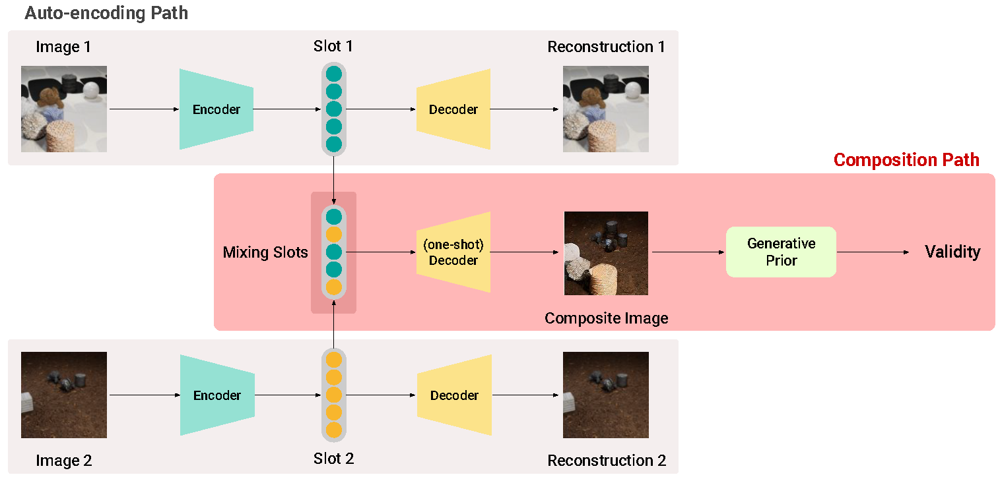

<<<<<<< HEAD
# Learning-to-compose
[ICLR'24] Learning to Compose: Improving Object Centric Learning by Injecting Compositionality

To be updated Soon.
=======
# Learning to Compose: Improving Object Centric Learning by Injecting Compositionality (ICLR 2024)

This repository is an official implementation of the paper:\
**[Learning to Compose: Improving Object Centric Learning by Injecting Compositionality](https://arxiv.org/pdf/2405.00646) (ICLR 2024)**\
Whie Jung, Jaehoon Yoo, Sungjin Ahn, Seunghoon Hong



## Setup

1. Download datasets.
* ClevrTex : In order to download clevrtex in hdf5 format, use following command : 
```
# code from https://github.com/addtt/object-centric-library
python download_data.py -p [dir_to_be_downloaded] -d clevrtex
```
* MSN : [Link](https://drive.google.com/drive/folders/1xNV5nE7ggzISvPU36B_9NS-WlE3C78mC)
* PTR : [Link](https://github.com/evelinehong/PTR.git)

2. Change the paths of the dataset in ``data/data_paths.yaml``, accordingly.

3. You may install the required packages using the below commands. 
```
docker pull pytorch/pytorch:1.11.0-cuda11.3-cudnn8-devel
docker run -it --shm-size=24G pytorch/pytorch:1.11.0-cuda11.3-cudnn8-devel /bin/bash
git clone https://github.com/whieya/Learning-to-compose.git
pip install -r requirements.txt
cd models/diffusers
pip install -e .
```


## Training
The scripts for training can be found in `scripts` folder. You may excute the script as following:
```
# example for running clevrtex experiment
bash scripts/clevr/test.sh [PORT] [GPU_IDS]
# bash scripts/clevr/train_comp.sh 29050 0,1,2,3
```

* [PORT]:
  * The port to use to communicate with the machine of rank 0, e.g., 29050. 
* [GPU_IDS]:
  * 0,1,2,3 : use 4 GPUs from 0 to 3.

## Evaluation
The scripts for evaluation can be found in scripts folder as well. You may excute the script as following:
```
bash scripts/clevr/eval_comp.sh [PORT] 0 [ckpt_path]
```

## Acknowledgements
Our code refers the following repositores:
* [object-centric-library](https://github.com/addtt/object-centric-library.git)
* [SLATE](https://github.com/singhgautam/slate.git)

Also, we deeply thank [Jindong Jiang](https://www.jindongjiang.me/), the author of [Latent Slot Diffusion](https://arxiv.org/pdf/2303.10834),
for his invaluable assistance in the implementation of Latent Slot Diffusion part.

## Citation
If you find this work useful, please consider citing:
```
@inproceedings{jung2024l2c,
  title={Learning to Compose: Improving Object Centric Learning by Injecting Compositionality},
  author={Jung, Whie and Yoo, Jaehoon and Ahn, Sungjin and Hong, Seunghoon},
  booktitle={ICLR},
  year={2024}
}
```
>>>>>>> 79a60ad473ea5cbf932eaffde4c78a0839ec591c
